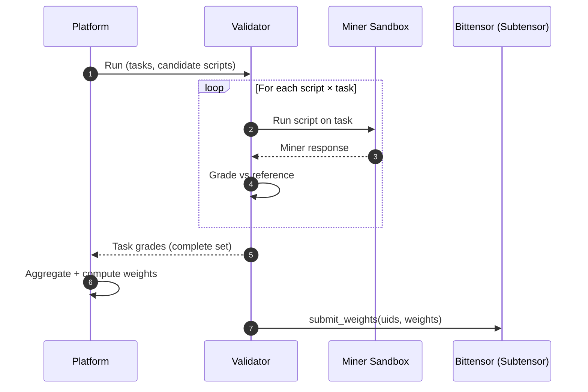
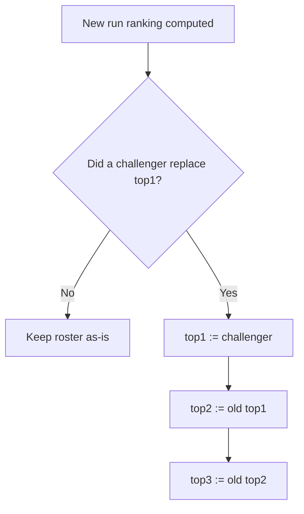

# Caster Subnet

This repository contains everything validator operators need to run a validator and everything miners need to build/test miner scripts and submit them to the platform.

## Packages

- `validator/` — validator runtime for operators
- `miner/` — miner-facing sandbox harness and local tooling
- `miner-sdk/` — SDK used by miner scripts
- `commons/` — shared utilities used by the above packages

## Entry points

- Validator operators: see `validator/README.md`
- Miner developers: see `miner/README.md`

## Incentive mechanism (overview)

This subnet rewards the best miner scripts by having validators run standardized tasks against them, aggregating results, and assigning emissions to a “sticky” top‑3 roster.

1) Miners submit scripts (code) to the platform.
2) The platform creates a run: tasks + candidate scripts.
3) The platform fans out the run to multiple validators.
4) Validators execute tasks against each script and return grades.
5) The platform aggregates validator grades into a ranking and computes weights.
6) Validators submit those weights on-chain (Bittensor).



### Sticky top‑3 roster rule

Only a top‑1 replacement updates the roster:



## Local development

This repository is a UV workspace. To install dependencies:

```bash
uv sync --all-packages --dev
```
