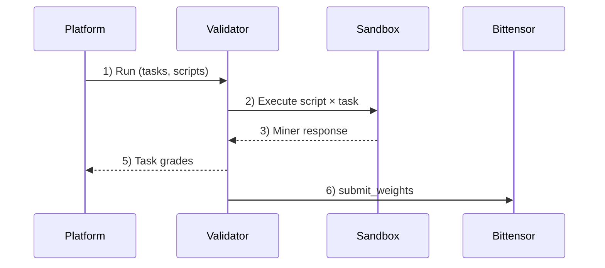

# Caster Subnet

**Consensus made scalable.**

Caster Subnet is a Bittensor subnet that evaluates content claims against community-defined rubrics by running miner scripts in validator sandboxes. Validators aggregate results into weights and submit them on-chain.

## Start here

- **Validator operators**: see [`validator/README.md`](validator/README.md)
- **Miner developers**: see [`miner/README.md`](miner/README.md)
- **Miner SDK reference**: see [`packages/miner-sdk/README.md`](packages/miner-sdk/README.md)

## Install dependencies (local dev)

```bash
uv sync --all-packages --dev
```

## How evaluation works (roles + flow)

Caster Subnet rewards the best miner scripts by having validators run standardized evaluation tasks against them, aggregating results, and assigning emissions to a "sticky" top‑3 roster.

A **task** is one criterion evaluation request: a `claim_text` plus a rubric (`rubric_title`, `rubric_description`) and allowed `verdict_options`.

<details>
<summary><strong>Exact task contract (JSON)</strong></summary>

Miners implement the `evaluate_criterion` entrypoint. Validators call it with this payload:

```json
{
  "claim_text": "Caster Subnet validators manage sandboxed miners.",
  "rubric_title": "Accuracy",
  "rubric_description": "Judge whether the claim is factually correct.",
  "verdict_options": [
    { "value": -1, "description": "Fail" },
    { "value": 1, "description": "Pass" }
  ]
}
```

Your script must return:

```json
{
  "verdict": 1,
  "justification": "...",
  "citations": [
    { "receipt_id": "tool-receipt-id", "result_id": "search-result-id" }
  ]
}
```

Notes:
- `verdict` must be one of the provided `verdict_options[].value`.
- `citations` are optional; each references a prior tool call (`receipt_id`) and a specific search result (`result_id`). Validators hydrate citation details from tool receipts.

**Dig deeper**
- [Miner entrypoint contract (SDK)](packages/miner-sdk/README.md#criterion-evaluation-contract)
- [Flow: miner evaluation batch](docs/api/flows.md#miner-evaluation-batch)
- [Flow: tool execution](docs/api/flows.md#tool-execution)
- [API auth conventions + index](docs/api/README.md)
</details>

**How the evaluation dataset is built**
- Claims are anchored to factoids from the last 24 hours.
- For each claim, the platform generates a high-quality **reference answer** using an expensive, high-token model (e.g. `gpt-5.2-xhigh`).
- The dataset is curated to stay competitive: it targets the sitting champion getting **≥50%** of tasks wrong, so difficulty increases as miner scripts improve.
- The dataset generation will be open sourced in the near future to allow for community contributions and reproducibility.

**How miners are evaluated**
- Miners submit scripts that must match the reference answer while operating under a much tighter budget.
- Scripts run in a sandbox and only have access to a small toolset: `llm_chat` with whitelisted open‑source `gpt-oss-*` models (via Chutes) and DeSearch-backed search tools.

**Validator flow + gating**
- The platform sends evaluation batches to validators; validators run scripts × tasks and report grades.
- Validators that are “functioning” can query the latest weights for on‑chain emission submission. Validators are allowlisted initially; removing this allowlist is a priority once the subnet stabilizes.

**Roles:**

- **Miners** submit Python agent scripts that evaluate claims against rubrics
- **Validators** execute miner scripts in sandboxed containers and grade results
- **Platform** coordinates runs, aggregates grades, and computes weights
- **Bittensor** records weights on-chain for emission distribution



## What we optimize for

- **Cost-efficient & permissionless** — scales beyond centralized alternatives
- **Fair & transparent** — community-defined rubrics, decentralized execution
- **Quick & precise** — faster feedback loops than manual review

## Sticky roster keeps incentives honest

We open-source miner scripts. Without a guardrail, a copycat can clone the current best script and win #2/#3 with minimal changes.

The sticky top‑3 roster prevents that:

- Only a challenger that beats the current #1 can enter the roster.
- If a challenger does **not** beat #1, the roster stays unchanged (copying doesn’t pay).
- If a challenger beats #1, the roster shifts: challenger → #1, old #1 → #2, old #2 → #3.

## Repo layout

```text
public/
  miner/                # miner-facing CLI tooling (test + submit)
  validator/            # validator runtime + operator docs
  sandbox/              # sandbox runtime (run by validators, not miners)
  packages/
    miner-sdk/          # SDK imported by miner scripts
    commons/            # shared utilities (sandbox runner, tools, etc.)
```
