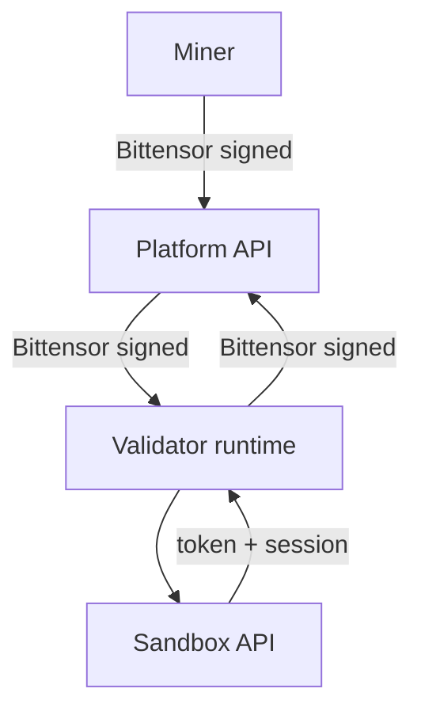

# Caster subnet HTTP APIs

This directory documents the **subnet-facing HTTP endpoints** which miners/validators interact with.

## Endpoint references (generated)
- Platform (miners/validators): [generated/platform.md](generated/platform.md)
- Validator: [generated/validator.md](generated/validator.md)
- Sandbox: [generated/sandbox.md](generated/sandbox.md)

## Auth conventions used across services

- **Bittensor-signed requests**
  - `Authorization: Bittensor ss58="<ss58>",sig="<hex>"`
  - Signature is over canonical `{method, path+query, body}`.
- **Sandbox tool execution (token + session)**
  - Validator → Sandbox: `x-caster-session-id` + `x-caster-token` headers
  - Sandbox → tools: `POST /v1/tools/execute` includes `session_id` + `token`

## Flows (sequence diagrams)
All Mermaid sequence diagrams live in [flows.md](flows.md), grouped by domain:

- Subnet runtime (Platform ↔ Validator ↔ Miner)
  - [flows.md#miner-script-upload](flows.md#miner-script-upload)
  - [flows.md#miner-evaluation-batch](flows.md#miner-evaluation-batch)
- Subnet ops (Platform ↔ Validator)
  - [flows.md#validator-registration-and-weights](flows.md#validator-registration-and-weights)

## Service interaction map

