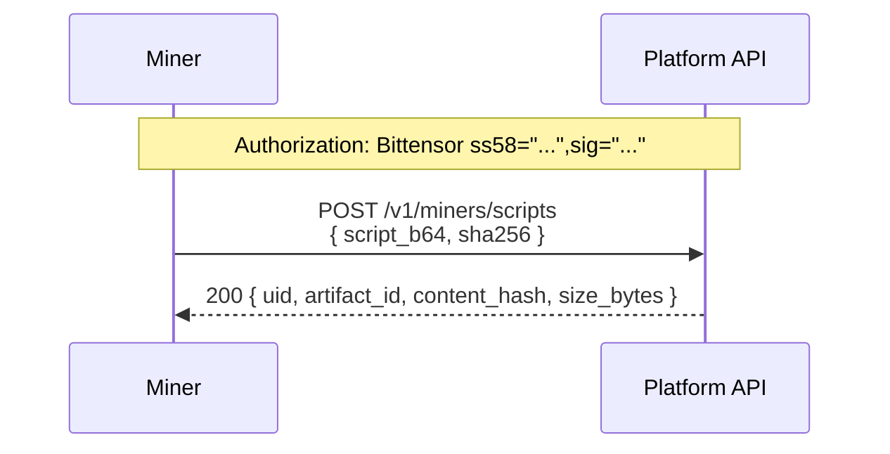
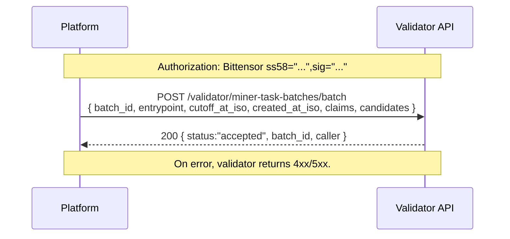
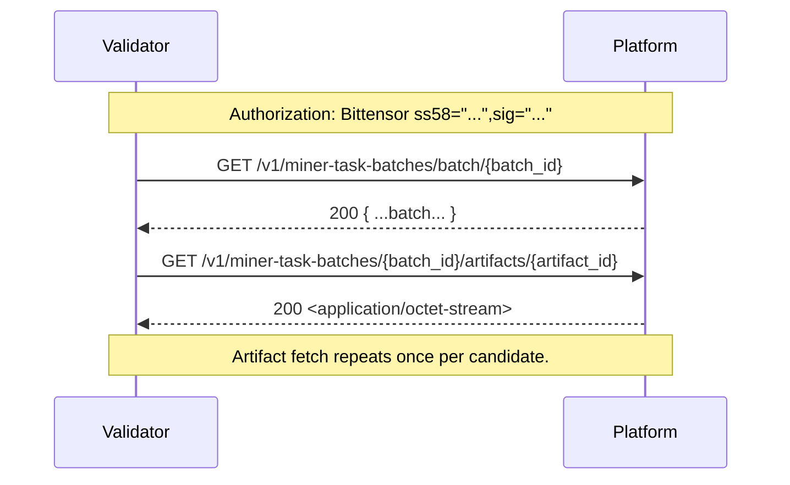
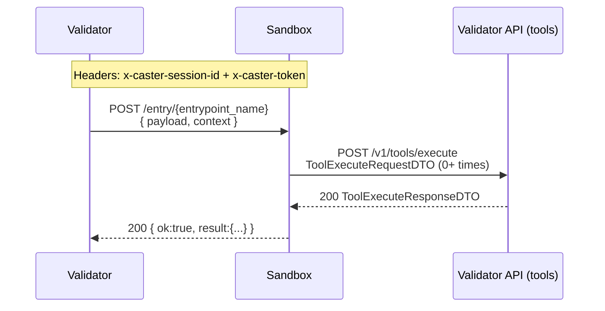
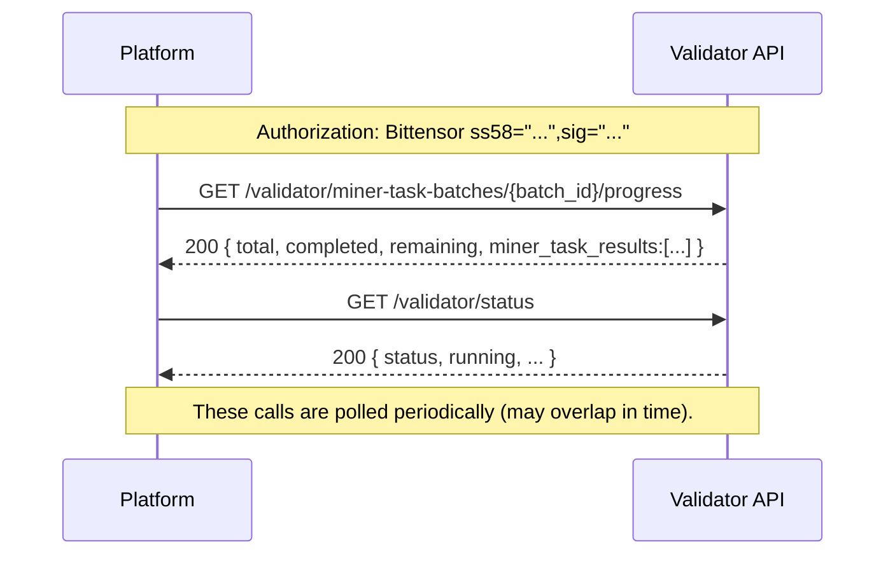
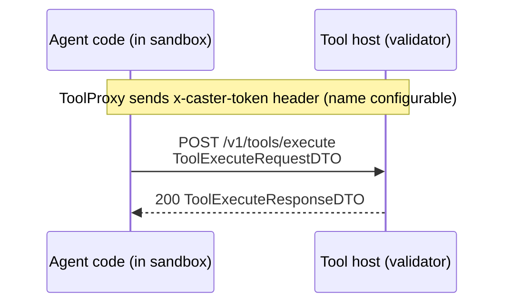
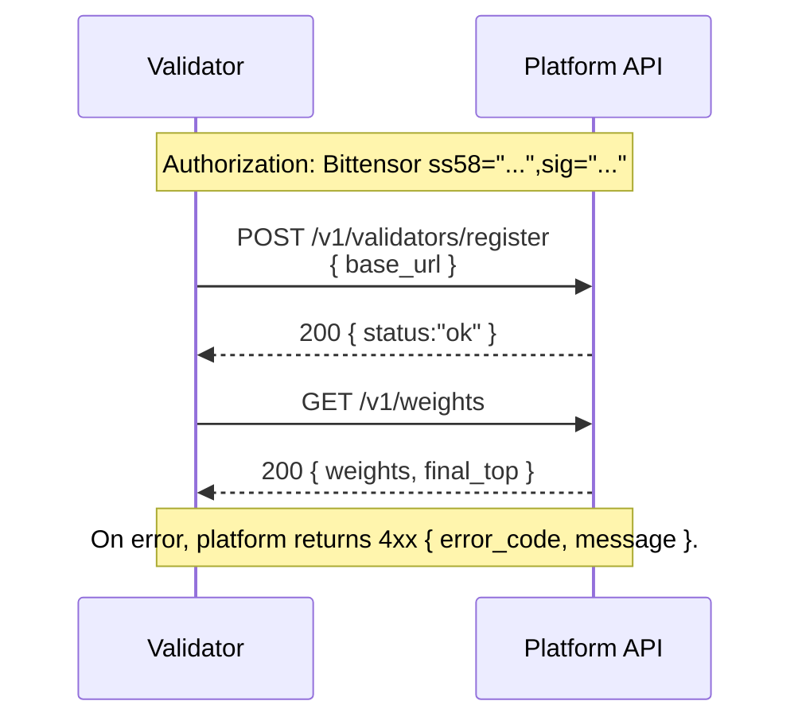

# Caster API flows (sequence diagrams)

All Mermaid **sequence diagrams** live here (one document). For request/response shapes, use the generated endpoint references:
- Platform: [generated/platform.md](generated/platform.md)
- Validator: [generated/validator.md](generated/validator.md)
- Sandbox: [generated/sandbox.md](generated/sandbox.md)

## Diagram style

These diagrams are intentionally **linear** (no `alt` / `par` / `loop`) to keep them easy to read. Any “optional / repeated / concurrent” behavior is described in short notes next to the diagram.

## Quick index

- Subnet runtime (Platform ↔ Validator ↔ Miner)
  - [Miner script upload](#miner-script-upload)
  - [Miner evaluation batch](#miner-evaluation-batch)
  - [Tool execution](#tool-execution)
- Subnet ops (Platform ↔ Validator)
  - [Validator registration and weights](#validator-registration-and-weights)

## Flow catalog (fast scan)

| Domain | Flow | Goal | Actors | Auth |
|--------|------|------|--------|------|
| Subnet runtime | Miner script upload | upload script artifact | Miner ↔ Platform | `Authorization: Bittensor ...` |
| Subnet runtime | Miner evaluation batch | forward batch + run sandbox + poll progress | Platform ↔ Validator ↔ Sandbox | `Authorization: Bittensor ...` + token/session |
| Subnet runtime | Tool execution | agent invokes host tools | Sandbox agent ↔ Tool host | token + session |
| Subnet ops | Validator registration and weights | register API base URL; read weights | Validator ↔ Platform | `Authorization: Bittensor ...` |

---

## Subnet runtime (Platform ↔ Validator ↔ Miner)

These flows are the subnet’s core evaluation path.

### Miner script upload

| Overview | |
|---|---|
| **What’s happening** | Miner uploads a script artifact that later becomes a batch candidate. |
| **Actors** | Miner ↔ Platform |
| **Auth** | `Authorization: Bittensor ss58="...",sig="..."` |
| **Happy path** | `POST /v1/miners/scripts` returns `{ artifact_id, ... }` |

**Endpoints involved**
- Platform (miner): [POST /v1/miners/scripts](generated/platform.md#endpoint-post-v1-miners-scripts)

---

### Miner evaluation batch

| Overview | |
|---|---|
| **What’s happening** | Platform distributes a batch; validator fetches artifacts; validator runs sandbox entrypoint; platform polls progress + status. |
| **Actors** | Platform ↔ Validator API ↔ Sandbox |
| **Auth** | Platform↔Validator is Bittensor-signed; Validator↔Sandbox uses token + session. |
| **Happy path** | forward batch → fetch artifacts → run sandbox → poll progress/status |

#### 1) Platform forwards a batch to validators

#### 2) Validator fetches batch + artifacts from the platform

#### 3) Validator invokes sandbox entrypoint (agent run)

#### 4) Platform polls validator for health + progress

**Endpoints involved**
- Platform:
  - [POST /v1/miner-task-batches/batch](generated/platform.md#endpoint-post-v1-miner-task-batches-batch)
  - [GET /v1/miner-task-batches/batch/{batch_id}](generated/platform.md#endpoint-get-v1-miner-task-batches-batch-batch_id)
  - [GET /v1/miner-task-batches/{batch_id}/artifacts/{artifact_id}](generated/platform.md#endpoint-get-v1-miner-task-batches-batch_id-artifacts-artifact_id)
- Validator:
  - [POST /validator/miner-task-batches/batch](generated/validator.md#endpoint-post-validator-miner-task-batches-batch)
  - [GET /validator/miner-task-batches/{batch_id}/progress](generated/validator.md#endpoint-get-validator-miner-task-batches-batch_id-progress)
  - [GET /validator/status](generated/validator.md#endpoint-get-validator-status)
  - [POST /v1/tools/execute](generated/validator.md#endpoint-post-v1-tools-execute)
- Sandbox:
  - [POST /entry/{entrypoint_name}](generated/sandbox.md#endpoint-post-entry-entrypoint_name)

---

### Tool execution

| Overview | |
|---|---|
| **What’s happening** | Sandboxed agent code invokes host-managed tools (search/LLM/etc.) over HTTP. |
| **Actors** | Agent (in sandbox) ↔ Tool host (validator) |
| **Auth** | token + session (`ToolExecuteRequestDTO` includes `session_id` + `token`) |
| **Happy path** | `POST /v1/tools/execute` returns `ToolExecuteResponseDTO` |

**Endpoints involved**
- Validator: [POST /v1/tools/execute](generated/validator.md#endpoint-post-v1-tools-execute)

---

## Subnet ops (Platform ↔ Validator)

These flows are about validator lifecycle and platform coordination.

### Validator registration and weights

| Overview | |
|---|---|
| **What’s happening** | Validator registers its public API base URL, then reads the current weights. |
| **Actors** | Validator ↔ Platform |
| **Auth** | `Authorization: Bittensor ss58="...",sig="..."` |
| **Happy path** | `POST /v1/validators/register` → `GET /v1/weights` |

**Endpoints involved**
- Platform:
  - [POST /v1/validators/register](generated/platform.md#endpoint-post-v1-validators-register)
  - [GET /v1/weights](generated/platform.md#endpoint-get-v1-weights)
